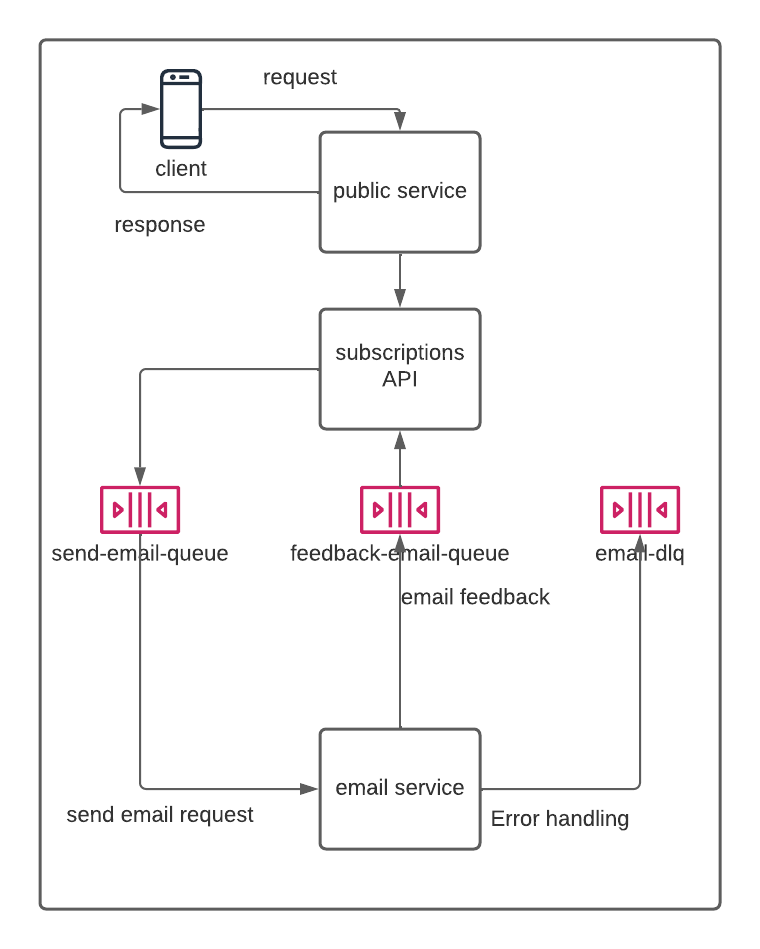

# adidas-subscription-service

Api to handle customers newsletter subscriptions

### Sonarcloud reports

* [subscriptions-api](https://sonarcloud.io/project/overview?id=lcssimonini_subscription-api) : Subscriptions API.
* [public-service](https://sonarcloud.io/project/overview?id=lcssimonini_public-service) : Public service.
* [email-service](https://sonarcloud.io/project/overview?id=lcssimonini_email-service) : Email service.

### Running Locally

Builds all the applications, creates the container images and runs the docker-compose file with the 3 services, mongodb database and rabbitmq

> sh run.sh

### Docker Environment

* [API Swagger](http://localhost:8080/swagger-ui.html) : API documentation.

### RabbitMQ management console:

* [Rabbit management](http://localhost:15672/) : RabbitMQ.

user: guest
password: guest

### Tools used on the project

- Java 11
- Gradle
- Junit 5
- Mockito
- Stubby4j
- Docker
- Docker compose
- Spring boot
- Spring data mongodb
- Spring AMPQ
- RabbitMQ
- Mongodb

